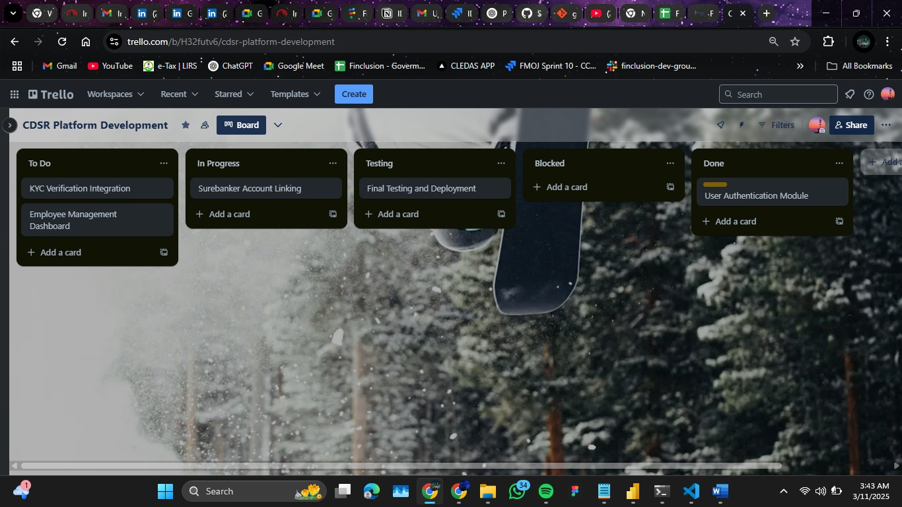

**Project Timeline Explanation**

**Project: CDSR Platform Development**

**Tool Used:** Trello
**Trello Link:** [CDSR Project Timeline](https://trello.com/invite/b/67cfa191ba5ed2157b5638cc/ATTI2cd9ea6a7f99239503334befb420b778772903B4/cdsr-platform-development)

**Trello JPG:** 
Steps to Create the Project Timeline:

**Steps to Create the Project Timeline:**
1. **Set Up the Board:**
   - Created a new board named "CDSR Platform Development" in Trello.
   - Added lists to represent different project stages: "To Do," "In Progress," "Testing," and "Completed."

2. **Defined Key Tasks:**
   - Created five primary tasks with deadlines:
     1. **User Authentication Module** – March 15, 2025
     2. **KYC Verification Integration** – March 20, 2025
     3. **Employee Management Dashboard** – March 25, 2025
     4. **Surebanker Account Linking** – March 30, 2025
     5. **Final Testing and Deployment** – April 5, 2025

3. **Assigned Team Members:**
   - Assigned tasks to the respective team members:
     - **Frontend Development** – Abiodun
     - **Backend Development** – Osho
     - **Testing & QA** – General team effort

4. **Added Task Details:**
   - Included descriptions, checklists, and deadlines for each task.
   - Used Trello labels to mark task priorities (High, Medium, Low).

5. **Updated Progress Regularly:**
   - Moved tasks from "To Do" to "In Progress" and "Testing" as work progressed.
   - Used comments for real-time updates and collaboration.

**Screenshot:**
A screenshot of the project timeline in Trello has been saved as **project_timeline.png**.

This timeline helps in tracking development, ensuring timely completion, and facilitating effective team collaboration.

